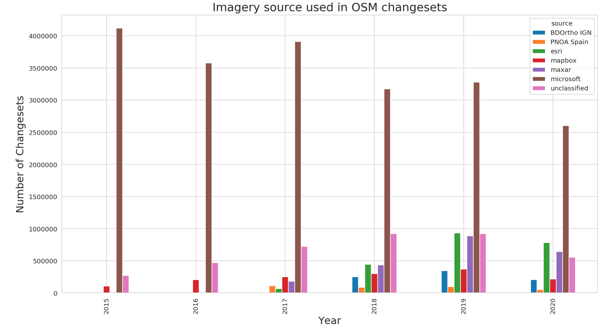

# Which providers of Aerial and Satellite Imagery are most used in OpenStreetMap?

This repository demonstrates one method of quantifying the `imagery_used` across all of the OpenStreetMap changesets.

First, use Amazon Athena to query the OpenStreetMap public dataset on AWS to extract relevant metadata from the OSM changeset record: 

```sql
SELECT   id,
         uid,
         "user",
         num_changes,
         date(created_at) AS date,
         tags['imagery_used'] AS imagery_used, 
         tags['hashtags'] AS hashtags, -- this should be an array, but spark doesn't like that
         tags['comment'] AS comment,
         tags['created_by'] AS created_by, 
         min_lat, max_lat, min_lon, max_lon
FROM changesets
WHERE tags['imagery_used'] is NOT null
      AND created_at > date '2015-01-01'
ORDER BY  date(created_at) DESC 
```

_Note: Only ~30M of ~60M changesets created since 2015 contain the `imagery_used` tag._

Then, read the resulting file (30M rows) into a PySpark dataframe as shown in the example [Notebook](https://github.com/jenningsanderson/imagery-used-tag/blob/master/OSM%20Changeset%20Imagery%20Tag%20Analysis%20V2.ipynb) to create the following graph:




### Future Work: 

- [ ] Break this down by editing software. The editor imagery defaults are going to be huge indicators of which imagery gets used.
- [ ] Break this down geographically? 
- [ ] Break this down by contribution type? (corporate, humanitarian, etc.)


Which editing software is not including the `imagery_used` tag? 

...JOSM, the answer is unequivocally JOSM; 27M of the 30M untagged changesets since 2015 are JOSM

```sql
SELECT substr(tags['created_by'],1,8) as editor,
       year(created_at) as year,
       count(id) as changesets,
       count(distinct(uid)) as users
FROM changesets
where tags['imagery_used'] is null
and created_at >= date '2015-01-01'
group by year(created_at), substr(tags['created_by'],1,8)
order by count(id) desc 
```
